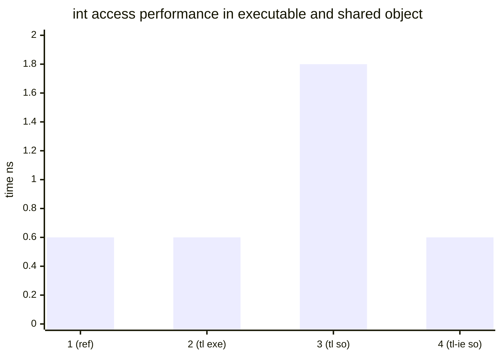

---
# global part
# You can also start simply with 'default'
theme: seriph
title: Thread local
info: |
  C++ thread_local.

# https://sli.dev/features/drawing
drawings:
  persist: false
# slide transition: https://sli.dev/guide/animations.html#slide-transitions
transition: fade
# enable MDC Syntax: https://sli.dev/features/mdc
mdc: true

addons:
    - slidev-component-progress

# first slide part
background: ./thread_local.jpg
# background: https://images.unsplash.com/photo-1623018035782-b269248df916?q=80&w=2070&auto=format&fit=crop&ixlib=rb-4.0.3&ixid=M3wxMjA3fDB8MHxwaG90by1wYWdlfHx8fGVufDB8fHx8fA%3D%3D

# apply "all text in the center" style to the first silde
class: text-center
hideInToc: true
---

<style> h1 { text-align: center; } </style>

# C++ thread_local

<br>

## lifetime & performance

---
layout: two-cols
hideInToc: true
---

<br>
<br>
<br>
<br>
<br>
<br>
<br>

# Agenda

::right::

<style> .slidev-toc { font-size: 22px; margin-left: -20px; margin-top: 40px; }  </style>
<Toc minDepth="1" maxDepth="1" />


---
layout: two-cols-header
layoutClass: gap-6
---

# Basics

### Each thread has its own copy of a thread_local variable.

::left::

```cpp
#include <thread>
#include <iostream>

thread_local int v = 0;
thread_local std::string s;
int main(){
    v = 1;
    s = "main";  // main thread has its own values
    std::thread t([](){
        v = 2;
        s = "thread"; // each thread has its own values 
        std::cout << s << " v: " << v << "\n";
    });
    t.join();
    std::cout << s << " v: " << v << "\n" ;
    return 0;
}
```

::right::

```console
thread v: 2
main v: 1
```

---
layout: two-cols-header
layoutClass: gap-6
hideInToc: true
---

# Implicitly static in block scope

### `static` can define `static storage duration` or `internal linkage`.

::left::

#### In block scope - static storage duration  
#### `static thread_local` == `thread_local`

```cpp

class S{
  // thread_local cannot be an object member
  // thread_local implies static
  thread_local int m_staticTL1; // == static thread_local
  static thread_local int m_staticTL2; // == thread_local
};

int f(){
  // thread_local cannot be automatic
  // thread_local implies static
  thread_local int m_staticTL3; // == static thread_local
  static thread_local int m_staticTL4; // == thread_local
  return m_staticTL;
}
```
<br>
<br>
<br>
::right::

#### Out of block scope - internal linkage  
#### `thread_local` behaves as other types 

```cpp
// external linkage (visible for other cpp files / modules)
thread_local int m_externalLinkageTL;

// internal linkage (visible for this cpp only)
static thread_local int m_internalLinkageTL;

```

---
layout: two-cols-header
layoutClass: gap-6
---

# Scalar Types Lifetime
#### Scalar types are always valid (from the thread initialization till the end of the thread existence)
::left::

```cpp
#include <iostream>

// some library
thread_local int lastError = 0; // library internal variable
// library API
void apiCall() { lastError = 55; }
int  getApiLastError() { return lastError; }

// user code that is using library API after main  
struct ApiUsage{
  ApiUsage() { apiCall(); }
  ~ApiUsage(){
    std::cout << "Last error code: " << getApiLastError() << "\n";
  }
};

// global variable. Ctor before main() and Dtor after main() 
ApiUsage apiUsageInstance;

int main(){ return 0; }
```

::right::

```console
Last error code: 55
```

---
layout: two-cols-header
layoutClass: gap-6
---

# Class Lifetime : Destruction
#### `thread_local` objects are destroyed before regular static objects
::left::

```cpp
#include <iostream>

// some library
thread_local std::string lastErrorMsg; // library internal variable
// library API
void apiCall() { lastErrorMsg = "An error explanation"; }
const char* getApiLastErrorMsg() { return lastErrorMsg.c_str(); }

// user code that is using library API after main  
struct ApiUsage{
  ApiUsage() { apiCall(); }
  ~ApiUsage(){
    std::cout << "Last error msg: " << getApiLastErrorMsg() << "\n";
  }
};

// global variable. Ctor before main() and Dtor after main() 
ApiUsage apiUsageInstance;

int main(){ return 0; }
```

::right::

```console
Last error msg: K
```

lastErrorMsg was destroyed before `apiUsageInstance` dtor invocation.

---
layout: two-cols-header
layoutClass: gap-6
---

# Class Destruction : WA-0 (POD)
#### if possible - use Plain Old Data structures. E.g. `string` becomes `char[]`.
#### Applicable if a resource management is not required.
::left::

```cpp
#include <iostream>

// some library
thread_local char lastErrorMsg[1024]; // library internal variable
// library API
void apiCall() { strcpy(lastErrorMsg, "An error explanation"); }
const char* getApiLastErrorMsg() { return lastErrorMsg; }

// user code that is using library API after main  
struct ApiUsage{
  ApiUsage() { apiCall(); }
  ~ApiUsage(){
    std::cout << "Last error msg: " << getApiLastErrorMsg() << "\n";
  }
};

// global variable. Ctor before main() and Dtor after main() 
ApiUsage apiUsageInstance;
int main(){ return 0; }
```

::right::

```console
Last error msg: An error explanation
```

lastErrorMsg is POD so it has no Dtor


---
layout: two-cols-header
layoutClass: gap-2
hideInToc: true
---

# Class Destruction : WA-1 (Destruction check)
#### Add a check if a variable was destroyed. 
#### It provides a safe access to `thread_local` after `main()` but it does not prolong its lifetime.
::left::

```cpp
template <class T>
struct ClassWithValidation : T{
    template <class ... TArgs>
    ClassWithValidation(bool & isAlive, TArgs ... args)
    : m_isAlive(isAlive)
    , T(std::forward<TArgs>(args)...) 
    {}
    ~ClassWithValidation() { m_isAlive = false; }
  private:
    bool & m_isAlive;
};
thread_local ClassWithValidation<std::string> lastErrorMsg;
thread_local bool isLastErrorMsgAlive = true;

void setLastErrorMsg(std::string const & str){
  if (isLastErrorMsgAlive) lastErrorMsg = str;
}
// after main() it returns nullptr
const char* getApiLastErrorMsg() { 
  return isLastErrorMsgAlive ? lastErrorMsg.c_str() : nullptr; 
}
```
<br>
<br>
::right::

```c
1. m_isAlive variable is set to false inside DTOR
2. bool is a scalar so isLastErrorMsgAlive can be accessed 
   safely always
```
<br>
<br>
<br>
<br>
<br>
<br>
<br>


```c
lastErrorMsg access requires isLastErrorMsgAlive check
1. setter sets a new value depending on isLastErrorMsgAlive
2. getter returns a string or nullptr 
   according to isLastErrorMsgAlive
```

---
layout: two-cols-header
layoutClass: gap-2
hideInToc: true
---

# Class Destruction: WA-2 (Prolong lifetime)
#### Add a static variable as a main thread value. 
#### Select `main-thread` instance for main thread or `thread_local` otherwise.
#### This WA requires WA-1 for corner cases: signals, dlopen, exit.
::left::

```cpp
thread_local std::string lastErrorMsg; // library internal variable
thread_local bool isMainThread = false; // true in main thread only
static std::string lastErrorMsgMainThread = [](){
    isMainThread = true; 
    return std::move(lastErrorMsg);
}();

std::string & getLastErrorMsgInstance() {
  return isMainThread ? lastErrorMsgMainThread : lastErrorMsg
}

// library API
void apiCall() { 
  getLastErrorMsgInstance() = "An error explanation"; 
}
const char* getApiLastErrorMsg() { 
  return getLastErrorMsgInstance().c_str(); 
}
```

::right::

```cpp
create 2 instances of a variable : 
  static       : main thread variable
  thread_local : variables of the rest of the threads 

isMainThread is set at 'lastErrorMsgMainThread' init
isMainThread is 'true' in the main thread only
We treat a thread that initializes 
lastErrorMsgMainThread as a main thread.

'getLastErrorMsgInstance' selects a variable 
                          depending on isMainThread


```

---
layout: two-cols-header
layoutClass: gap-2
---

# Class lifetime : Construction
#### Assume we want to print thread_id for each thread at its construction and destruction. 
::left::

```cpp
#include <thread>
#include <iostream>
#include <unistd.h>

struct ThreadLogger{
    ThreadLogger()  { std::cout << "CTOR tid: " << gettid() << "\n"; }
    ~ThreadLogger() { std::cout << "DTOR tid: " << gettid() << "\n"; }
};

thread_local ThreadLogger threadLogger;

int main(){
    std::thread t([](){
        std::cout << "thread\n";
    });
    t.join();

    std::cout << "main\n" ;
    return 0;
}
```
::right::

<v-switch>
<template #0>
The following output is expected:
```console
CTOR tid: 1
CTOR tid: 2
thread
DTOR tid: 2
main
DTOR tid: 1
```

</template>
<template #1>
The real output (gcc/clang):
```console
thread
main
```

Why no `thread_local` variable was constructed?

A `thread_local` variable is constructed before the first time a thread accesses it.

If a thread never accesses a `thread_local` variable, it might never be constructed for that thread.
</template>

</v-switch>

---
layout: two-cols-header
layoutClass: gap-2
hideInToc: true
---

# Class lifetime : Construction (gcc/clang specific)

#### gcc/clang are using one boolean guard for all thread_local variables
#### Implications: if one `thread_local` is accessed - all `thread_local` of this thread are initialized.
::left::

```cpp
int getpid();
int gettid();

// 2 thread_local variables with non trivial init
thread_local int tid = gettid();
thread_local int pid = getpid();

// pretend we use a variable 
void print(int v);

// a function that uses tid
void f(){
    print(tid);
}
```


::right::

```asm
f():
        cmp     BYTE PTR fs:__tls_guard@tpoff, 0 # Is TLS initialized
        je      .TLS_Init                   # jmp to TLS Initialization
.Continue:        
        mov     edi, DWORD PTR fs:tid@tpoff # read tid
        jmp     print(int)                  # call print(tid)
.TLS_Init:                                  # TLS initialization
        mov     BYTE PTR fs:__tls_guard@tpoff, 1 # mark TLS "initialized"
        call    gettid()                    
        mov     DWORD PTR fs:tid@tpoff, eax # init tid with gettid()
        call    getpid()                    
        mov     DWORD PTR fs:pid@tpoff, eax # init pid with getpid()  
        jmp     .Continue
__tls_guard:            # Thread Local Storage section
        .zero   1       # TLS guard - checks if the section initialized
pid:
        .zero   4       # thread_local pid
tid:
        .zero   4       # thread_local tid
```

---
layout: two-cols-header
layoutClass: gap-2
hideInToc: true
---

# Class lifetime : Construction
#### In reality many threads access `thread_local` variables and `ThreadLogger` will work. 
::left::

```cpp
#include <thread>
#include <iostream>
#include <unistd.h>

struct ThreadLogger{
    ThreadLogger()  { std::cout << "CTOR tid: " << gettid() << "\n"; }
    ~ThreadLogger() { std::cout << "DTOR tid: " << gettid() << "\n"; }
};
thread_local ThreadLogger threadLogger;
thread_local int v = 0; // added another variable
int main(){
    (void)v; // access v
    std::thread t([](){
        (void)v; // access v
        std::cout << "thread\n";
    });
    t.join();

    std::cout << "main\n" ;
    return 0;
}
```
::right::
<v-switch>
<template #0>

We added a `thread_local` variable and read it in all the treads.

Will it work now?
</template>
<template #1>

```console
thread
main
```

Still does not work!<br><br>
`v` has static initialization (with a constant value).<br>it means `v` is initialized in the beginning of the thread.  
`tls_guard` is not used for `v`.
</template>
</v-switch>

---
layout: two-cols-header
layoutClass: gap-2
hideInToc: true
---

# Class lifetime : Construction
#### In reality many threads access `thread_local` variables and `ThreadLogger` will work. 
::left::

```cpp
#include <thread>
#include <iostream>
#include <unistd.h>

struct ThreadLogger{
    ThreadLogger()  { std::cout << "CTOR tid: " << gettid() << "\n"; }
    ~ThreadLogger() { std::cout << "DTOR tid: " << gettid() << "\n"; }
};
thread_local ThreadLogger threadLogger;
thread_local int v = gettid(); // dynamic initialization
int main(){
    (void)v; // access v
    std::thread t([](){
        (void)v; // access v
        std::cout << "thread\n";
    });
    t.join();

    std::cout << "main\n" ;
    return 0;
}
```
::right::

```console
CTOR tid: 1
CTOR tid: 2
thread
DTOR tid: 2
main
DTOR tid: 1
```

Now both main thread and `t` access a `thread_local` variable so threadLogger is initialized and its logs are printed.

---
layout: two-cols-header
layoutClass: gap-2
hideInToc: false
---

# Performance : Microbenchmark

::left::

```cpp 
volatile int sum = 0;
// variable we measure access to 
volatile thread_local int value = 0;
// code that we measure
{ 
  if (value) sum = 1; 
}
```
<br>



::right::

| |ns| |variable description|
|--|--|-|--|
|1 |0.6| 1x| regular variable as a reference|
|2 |0.6| 1x| thread_local in executable|
|3 |1.8| 3x| thread_local in SO-PIC|
|4 |0.6| 1x| thread_local "initial-exec" in SO-PIC| 

<sup>*</sup>SO-PIC - Shared Object (.so) built with Position Independent Code (PIC) flag
---
layout: two-cols-header
layoutClass: gap-2
hideInToc: false
---

# Executable : Close Look

#### `fs` register points to the beginning of the thread data where `thread_local` variables reside.  
#### All the thread data are accessed as `fs + offset`. 

::left::
```cpp
int value = 0;
int getValue(){
    return value;
}
```
```cpp
thread_local int value_tl = 0;
int getValueTL(){
  return value_tl;
}
```

::right::
```asm
getValue():
        mov     eax, DWORD PTR value[rip]
        ret
```
<br>
```asm        
getValueTL():
        mov     eax, DWORD PTR fs:value_tl@tpoff
        ret
```
<br>
<br>
<br>
<br>
<br>

---
layout: two-cols-header
layoutClass: gap-2
hideInToc: false
---

# Shared Object built with -fPIC : Close Look

<br>

#### Shared object can be loaded with `dlopen` that's why its `thread_local` sections cannot be merged with the thread data of the executable.
#### Each access to `thread_local` variable requires its address calculation with `__tls_get_addr`
::left::
```cpp
thread_local int value_tl = 0;
int getValueTL(){
  return value_tl;
}
```

::right::
```asm        
getValueTL():
        sub     rsp, 8
        lea     rdi, value_tl@tlsld[rip]
        call    __tls_get_addr@PLT
        mov     eax, DWORD PTR value_tl@dtpoff[rax]
        add     rsp, 8
        ret
```

<br>
<br>
<br>
<br>

---

# Shared Object : performance workarounds

<br>


### WA-0. if there is no performance issue - don't fix!

<br>

### WA-1. if the library is never loaded with dlopen (rare case):
    use `-ftls-model=initial-exec`  
    this way all thread local sections will be merged into one at program start


---
layout: two-cols-header
layoutClass: gap-2
hideInToc: true
---

# Shared Object : performance workarounds

### WA-3. glibc reserves about 1KB inside thread data.  

It's possible to mark a performance critical variable `'initial-exec'`.  
`glibc` will add it to the main thread data.
It works with glibc only (musl does not support this trick).  

::left::
```cpp
__attribute((tls_model("initial-exec"))) 
thread_local int value_tl = 0;

int getValueTL(){
  return value_tl;
}
```

::right::

```asm        
getValueTL():
        mov     rax, QWORD PTR value_tl@gottpoff[rip]
        mov     eax, DWORD PTR fs:[rax]
        ret
```

---
layout: two-cols-header
layoutClass: gap-2
hideInToc: true
---

# Shared Object : performance workarounds

### WA-3.1 if `'initial-exec'` variable requires dynamic initialization - use a custom one

Dynamic initialization in this case might call `_tls_get_addr` to check initialization guard that affects performance.  
If the variable has an invalid state - then the implementation is trivial.  
if not - add a variable for this purpose: `thread_local bool isInitialized = false;`.

::left::

```cpp
int getInitValue();

const int InvalidValue = 0;

__attribute((tls_model("initial-exec"))) 
thread_local int value_tl = InvalidValue;

int getValueTLCustomInit(){
  if (value_tl == InvalidValue0) { 
    value_tl = getInitValue(); 
  }
  return value_tl;
}
```

::right::

```asm        
getValueTLCustomInit():
        mov     rbx, QWORD PTR value_tl@gottpoff[rip] # load offset
        mov     eax, DWORD PTR fs:[rbx]               # load value
        test    eax, eax                              # check if it's 0
        je      .CallInitFunc                         # call init if it's 0
        ret
.CallInitFunc:
        call    [QWORD PTR getInitValue()@GOTPCREL[rip]]
        mov     DWORD PTR fs:[rbx], eax
        ret
```

---
hideInToc: false
---

# Takeaways

<br>
1. Prefer being explicit - use `static thread_local`

2. **Lifetime of `thread_local` scalar types:** valid from the beginning till the end of the thread.

2. **Lifetime of `thread_local` objects:**  
   - **Construction**: Occurs before the first use, but no guarantees when exactly.
   - **Destruction**: Happens before regular static variables are destroyed. There are workarounds.  

3. **Performance of `thread_local`:**  
   - **In executables**: accessing `thread_local` variables is as fast as accessing regular variables.  
   - **In shared objects**: `thread_local` access is approximately **3x slower**.  
     If a variable access is in a performance-critical path, there is a workaround in some cases.
---
hideInToc: true
---

# Resources

<br>

1. maskray.me : about thread local storage  
   https://maskray.me/blog/2021-02-14-all-about-thread-local-storage
2. A Deep dive into (implicit) Thread Local Storage  
   https://chao-tic.github.io/blog/2018/12/25/tls
4. tls model attributes  
   https://www.ibm.com/docs/en/xl-c-and-cpp-aix/16.1?topic=attributes-tls-model-attribute   
3. this presentation:   
   https://alex-176.github.io/thread_local
<div style="text-align: center">

 {style="display: inline;" width="140px"}
</div>
